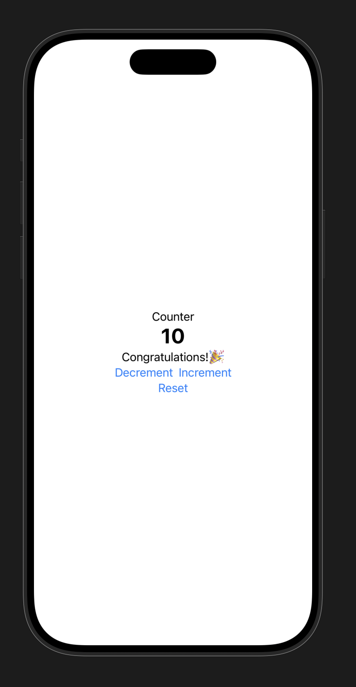

# IOSCounter

My first SwiftUI project.

## What I learned

- SwiftUI
- @State
- VStack
- HStack
- Button
- Text
- Conditional views (if)

## Features

- Increment counter
- Decrement counter
- Reset counter
- Prevent negative values
- Display messages at specific values

## Screenshot

